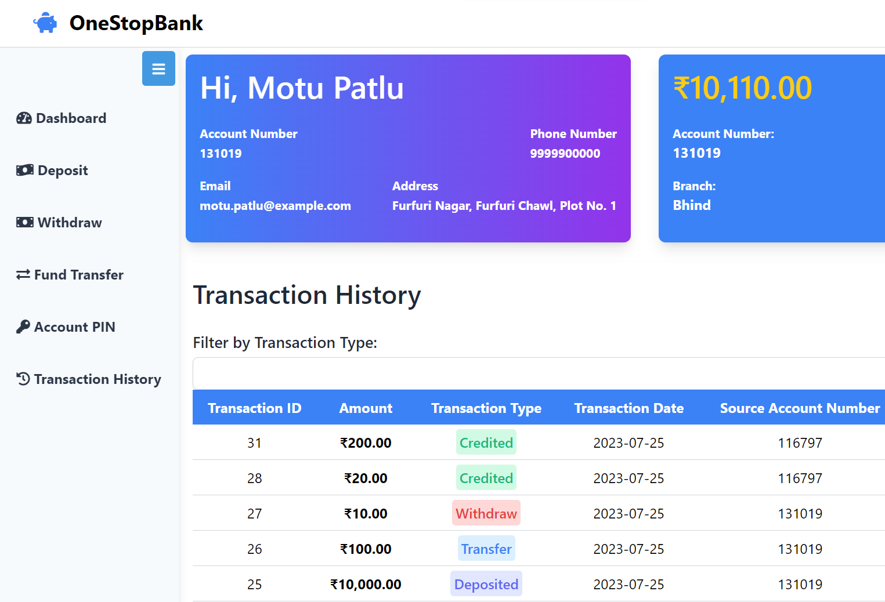

# OneStopBank - Premium Banking Portal

A comprehensive, full-stack digital banking solution built with **Spring Boot 3**, **Angular 14+**, and **MySQL**.



## 🚀 Features

- **Premium UI/UX:** Glassmorphism, dynamic animations, and a sleek modern dashboard built with Tailwind CSS.
- **Secure Authentication:** JWT-based stateless authentication with OTP email verification.
- **Dynamic Dashboard:** Real-time transaction analytics (Daily Pie Charts, Monthly Trends) utilizing Chart.js.
- **Account Operations:** 
  - Dynamic 10-digit account generation based on user demographics.
  - Fund Transfers (inbound & outbound routing).
  - Cash Deposits & Withdrawals.
- **Transaction History:** Real-time pagination, dynamic filtering, search capabilities, and PDF Statement exports.
- **Email Notifications:** automated, branded SMTP emails for Registration, Transactions, and Password Resets.

## 🛠 Tech Stack

### Backend
- **Java 17 & Spring Boot 3** (REST APIs)
- **Spring Security** (JWT + Bcrypt)
- **Spring Data JPA & Hibernate**
- **MySQL** (Relational Data)
- **Redis** (OTP Caching & Performance)

### Frontend
- **Angular 14+** (Standalone & Modules)
- **Tailwind CSS** (Utility-first styling & responsiveness)
- **Chart.js** (Data Visualization)

## 🏗 Setup & Installation

### Docker (Recommended)
You can instantly spin up the entire stack (Frontend, Backend, MySQL database, Redis) using Docker Compose:

```bash
docker-compose build
docker-compose up -d
```

- **Frontend Application:** `http://localhost:4200`
- **Backend API:** `http://localhost:8080/api`

### Local Development (Manual)
**1. Backend**
- Make sure you have Java 17+ and Maven installed.
- Update your database credentials in `backend/src/main/resources/application.properties`.
- Run: `cd backend && mvn spring-boot:run`

**2. Frontend**
- Make sure you have Node.js 18+ installed.
- Run: `cd frontend && npm install && npm start`

## 👨‍💻 Created By
**Jay Thesiya**
- [Portfolio](https://www.jaythesiya.me/)
- [GitHub](https://github.com/jay1466)

&copy; 2026 OneStopBank. All rights reserved.
